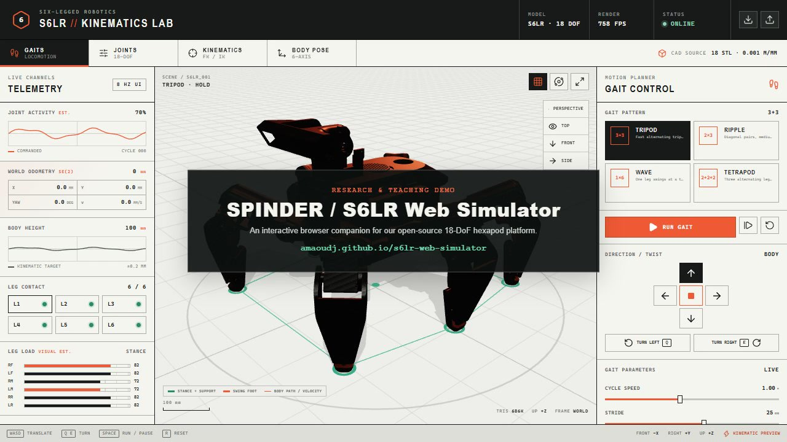

# S6LR Web Simulator

An interactive browser-based kinematics lab for the S6LR six-legged robot. The
viewer uses the original CAD STL meshes from the research workspace and exposes
all 18 actuated joints, analytical forward/inverse kinematics, body pose,
direction control, and four gait schedules. The robot translates and turns in
the world frame instead of walking in place.

## Demo

<p align="center">
  <a href="https://amaoudj.github.io/s6lr-web-simulator/media/SPINDER-S6LR-LinkedIn-Demo.mp4">
    
  </a>
</p>

<p align="center">
  <strong>
    <a href="https://amaoudj.github.io/s6lr-web-simulator/media/SPINDER-S6LR-LinkedIn-Demo.mp4">▶ Watch the 51-second simulator demo</a>
  </strong>
  ·
  <a href="https://amaoudj.github.io/s6lr-web-simulator/">Launch the live simulator</a>
  ·
  <a href="public/media/SPINDER-S6LR-LinkedIn-Demo.mp4">Download MP4</a>
</p>

## Included controls

- Tripod, ripple, wave, and tetrapod gait schedules
- World-frame forward, backward, lateral, and turning locomotion
- Body trajectory, velocity direction, stance/swing markers, and support polygon
- Live SE(2) odometry (X, Y, yaw, distance, and speed)
- Start, pause, single-step, reset, stride, speed, lift, and duty-factor controls
- Direction pad plus `W/A/S/D`, `Q/E`, and space-bar keyboard controls
- Manual hip/femur/tibia control for each leg
- Per-leg and mirrored inverse-kinematics target control
- Body height, roll, pitch, and yaw
- Perspective, top, front, and side camera presets
- Simulated contact/activity telemetry and exact joint/foot readouts
- Pose JSON export and import

## Model provenance and scope

The current model is derived from the working controller model at
`../Tracking_controller/xml/S6LR_v1.xml`. The original MJCF controller inputs,
gait generator, CPG oscillator, and non-RL runner are preserved under
`robot-source/tracking-controller`. The browser URDF is generated by
`scripts/build-corrected-urdf.mjs`, which converts the MJCF hinge pivots into
the correct parent-relative URDF frames. Browser-served copies live in
`public/models/s6lr`; only the two six-times-instanced servo meshes are
decimated for faster loading. Their dimensions and kinematic pivots remain
unchanged.

This application is a kinematic preview, not a rigid-body dynamics solver.
Torque and contact values shown in the interface are clearly marked as
estimated visual telemetry. The supplied MJCF masses, actuator ranges, and some
joint limits are not physically calibrated.

The locomotion teaching pipeline is:

1. body-twist command;
2. gait/phase scheduler;
3. stance and swing foot trajectories;
4. analytical inverse kinematics;
5. 18 commanded joint angles and world-frame odometry.

## Run locally

Node.js 22 or newer is required.

```bash
npm install
npm run dev
```

Then open `http://127.0.0.1:3000`.

## Public deployment

The repository includes a static Vite build for GitHub Pages. Every push to
`main` validates the analytical kinematics, builds `dist-pages`, and deploys it
with the workflow in `.github/workflows/deploy-pages.yml`.

```bash
npm run build:pages
npm run preview:pages
```

## Validate

```bash
npm run typecheck
npm run test:kinematics
npm run check
npm run build
```

The automated browser interaction check can be run against a production server:

```bash
npm run start
npm run smoke:browser
```

## Rebuild optimized meshes

```bash
python -m pip install -r scripts/requirements-mesh.txt
python scripts/optimize_meshes.py
```

## Citation

If you use this simulator, robot model, or controller in research or teaching,
please cite the SPINDER paper:

> Maoudj, A., Saputra, A.A., Brahmi, B. *et al.* SPINDER: an open-source
> 18-DoF hexapod robot with hierarchical central pattern generator control and
> analytic inverse kinematics. *Scientific Reports* (2026).
> https://doi.org/10.1038/s41598-026-56856-0

```bibtex
@article{maoudj2026spinder,
  author  = {Maoudj, Abderraouf and Saputra, Azhar Aulia and
             Brahmi, Brahim and Nouioua, Mourad},
  title   = {{SPINDER}: an open-source 18-{DoF} hexapod robot with
             hierarchical central pattern generator control and analytic
             inverse kinematics},
  journal = {Scientific Reports},
  year    = {2026},
  doi     = {10.1038/s41598-026-56856-0},
  url     = {https://doi.org/10.1038/s41598-026-56856-0}
}
```
